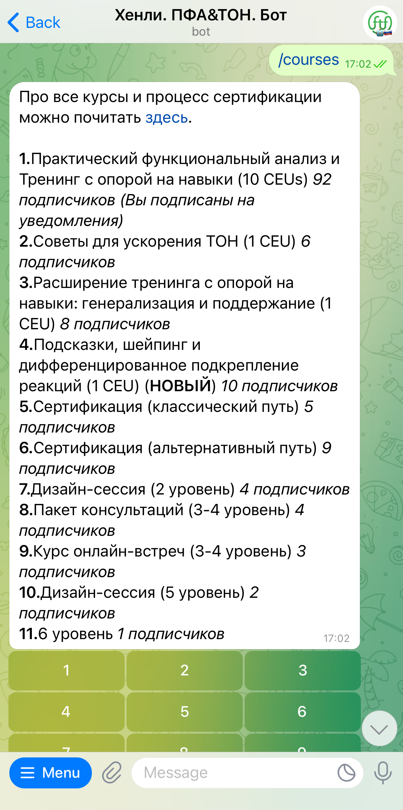
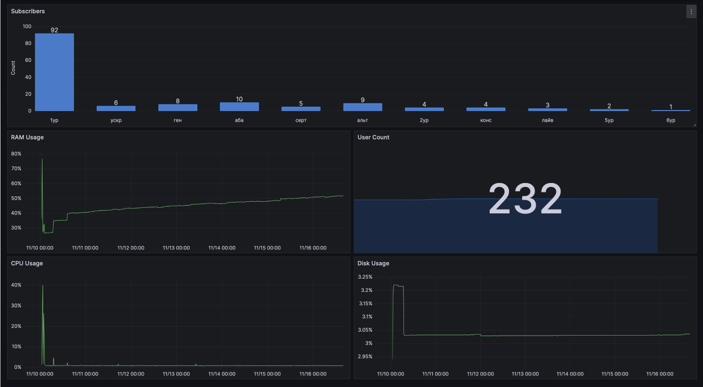
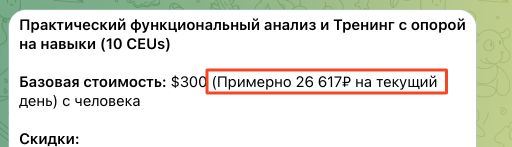

# Hanley bot

## History

Dr. Hanley is the CEO of [FTF Behavioral Consulting](https://ftfbc.com/), an organization that provides education for SBT (Skill-Based Training) and PFA (Practical Functional Assessment). SBT and PFA are the leading method of treating for problematic behavior in children and teens. Both are used in ABA — Applied Behavior Analysis, a scientific behavioral therapy, that has been proven to help children with autism regulate their behavior and learn new skills. Thanks to this, ABA has gained popularity, but in general, this therapy can be applied to any human.

## Why bot?

Russia [is the #1](https://t.me/pfa_sbt_rus/405) foreign country in terms of the number of people who have completed the basic SBT course. If you get a group of people, everyone gets a discount. This is how I and many other people educated this training.

In the recent years the process of purchasing the course from Russia became complicated, FTF is an American organization. In addition Russian specialists were interested in additional education. This is when I made a group and started cooperating with FTF directly. We found a way to transfer money and organized the first cohort for education. More people came in and I didn't have so much time to manage everyone by hand. This is why I decided to make a bot.

## What does it do?

First of all, people can learn about the courses, education or credentialing they need, subscribe for updates and learn more about everything available from FTF.
Before this people would spam in the group or in my DMs. : )


<p>
<em>/courses command brings the list of available course. User chooses the number using an inline keyboard</em>
</p>

Second of all, this solves a problem of tracking group participants. Basically, working as CRM: list of participants, did they transfer money, did they use a promocode, how will they pay, etc. This information is stored in an [PostgreSQL database like this](schemas.sql).

## Technical overview

Bot is written in C++ using [tgbot-cpp](https://github.com/reo7sp/tgbot-cpp) which is based on Boost.

Build process is managed by Conan and CMake.

For monitoring I use Prometheus and Grafana.

Logs are managed by Boost.Log, everything is logged into `/var/log/hanley_bot`



Availability is managed using systemctl service.

For currency information [OpenExchangeRates](https://openexchangerates.org) API is used.



> [!NOTE] 
> Check out [dialog state machine](src/state_machine_base.h) written for multi-staged forms with lots of C++ template magic.

https://github.com/GitSparTV/hanley_bot/assets/5685050/0ca42195-9599-4a1a-9862-073c1f336d99

Full list: C++, JSON, Boost, Conan, CMake, PostgreSQL, REST API, Telegram API, fmt

## Building

Requires: Conan (not 2.0 version), CMake, PostgreSQL

Run `build_win_debug.cmd` or `build_linux_release.sh`

## Running

1. Put `config.cfg` in `data/` folder. Config template:

```json
{
	"credentials": {
		"bot_token": "telegram_bot_api_token",
		"database_uri": "postgres_login_info",
		"exchange_api": "exchange_api_token"
	},
	"bot_config": {
		"bot_id": 0, // Bot Telegram ID
		"owner_id": 0, // Owner Telegram ID
		"group_id": 0, // Group Telegram ID
		"news_thread_id": 0 // Thread ID in which people can't write (obsolete because Telegram added "Close topic" feature)
	},
	"log_folder": "bot_%Y-%m-%d.log" // Log file format.
}
```

2. Run `./hanley_bot data/config.cfg`

[](http://hits.dwyl.com/GitSparTV/hanley_bot)
